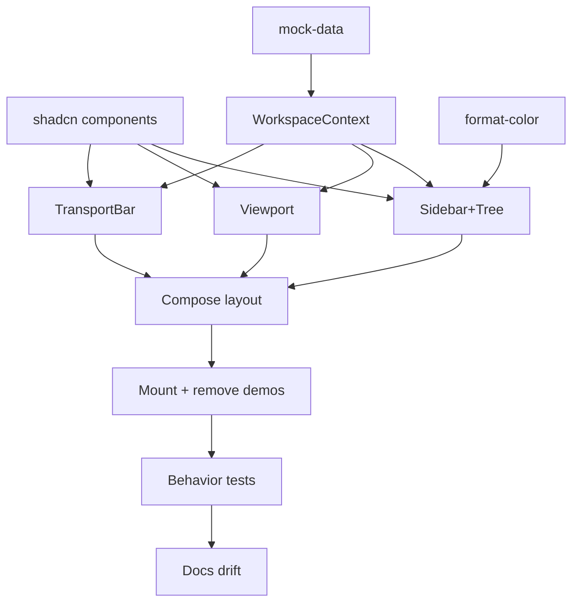

# Plan: Layout - MVP Player Shell

**Spec:** docs/features/20260619213615-layout/spec.md
**Created:** 2026-06-19
**Estimated Effort:** ~1 day
**Status:** Revising (v0.2 - user feedback rework; awaiting re-verification)

## 0. v0.2 Rework (user feedback)

Four changes to the v0.1 implementation, re-run through RED-GREEN-verify:
1. Progress bar -> rendered as the transport bar's **top border** (full-width line), not a mid-bar track.
2. Viewport -> **fills** the whole content area, **letterboxed** (black bars) on aspect mismatch (never stretched).
3. Sidebar -> **flat playlist** of open videos (NO folders/nesting). Drops the tree ADT, `tree-row`, `sidebar-tree`, folder expand/collapse + folder-select ACs. New `video-list` component.
4. Sidebar header -> **sort control** (ASC/DESC toggle), **natural/numeric-aware** ordering (`3` before `21`), driving both the list and prev/next. New `sort-natural` module.

Rework tasks:
| # | Task | Spec Ref | Files |
|---|------|----------|-------|
| R1 | Flatten mock-data to `mockVideos: VideoNode[]` (no `kind`/folder; numeric-prefixed names) | AC-003, §4 | `mock-data.ts` |
| R2 | `sort-natural.ts` - numeric-prefix-aware compare + direction | AC-010, §4, E-5 | `sort-natural.ts` |
| R3 | Rework context: flat `playlist` (open order, sortable), `sortDirection` state + `toggleSort`; drop tree/expand/folder logic | AC-008, AC-010, AC-012, E-2..E-6 | `workspace-context.tsx` |
| R4 | Replace `sidebar-tree`+`tree-row` with flat `video-list.tsx`; delete the two tree files | AC-003, AC-004, AC-009 | `video-list.tsx`, del `tree-row.tsx`/`sidebar-tree.tsx` |
| R5 | Sidebar header: title + sort toggle button | AC-010 | `sidebar.tsx` |
| R6 | Viewport: fill + letterbox (`aspect`/`object-contain`, black bars) | AC-005 | `viewport.tsx` |
| R7 | Transport: progress as top border (`role="progressbar"` full-width line) | AC-006 | `transport-bar.tsx` |
| R8 | Rewrite tests (drop folder/tree tests; add flat-list, sort, letterbox, top-border) | AC-014, TCs | `__tests__/*`, `fixtures.ts` |

## 1. Overview

Build the player shell with mock data and UI-local state only. Approach: context-driven
compound components (mirrors requi) - one `WorkspaceProvider` owns all UI state; panels
read it via a `useWorkspace()` hook (no prop drilling). Replace the bootstrap home page;
remove the top nav and command palette. Resizable sidebar|content split via shadcn
`resizable`. The transport bar is a fixed control strip below the viewport (not a
resizable pane).

## 2. Task Breakdown

| # | Task | Spec Ref | Files | Type | Estimate |
|---|------|----------|-------|------|----------|
| 1 | Add shadcn components: resizable, scroll-area, badge, slider (pulls react-resizable-panels) | deps, AC-012 | `src/components/ui/*`, `package.json` | impl | 0.5h |
| 2 | Mock data module: ADT tree (folder/video) + seed to approved layout (>=3 deep) | AC-003, data model | `src/components/workspace/mock-data.ts` | impl | 0.5h |
| 3 | format-color map (per VideoFormat badge color) | AC-011 | `src/components/workspace/format-color.ts` | impl | 0.25h |
| 4 | WorkspaceContext + provider + `useWorkspace` hook (state + actions, immutable, flat playlist order for prev/next) | AC-013, AC-005, AC-006, AC-010, behavior notes | `src/components/workspace/workspace-context.tsx` | impl | 1.5h |
| 5 | SidebarTree + recursive TreeRow (folders expand/collapse, video leaf badge, selection) | AC-003, AC-004, AC-005, AC-006, AC-011 | `src/components/workspace/{sidebar,sidebar-tree,tree-row}.tsx` | impl | 1.5h |
| 6 | Viewport (mock frame + name + resolution; empty state) | AC-007 | `src/components/workspace/viewport.tsx` | impl | 0.5h |
| 7 | TransportBar (prev/play-pause/next + inert slider + time readout) | AC-008, AC-009, AC-010 | `src/components/workspace/transport-bar.tsx`, `src/components/workspace/format-time.ts` | impl | 1h |
| 8 | Compose Content (viewport over transport) + WorkspaceLayout (resizable sidebar\|content) | AC-002, AC-012 | `src/components/workspace/{content,workspace-layout}.tsx` | impl | 0.75h |
| 9 | Mount at home route; remove demo home page, top nav, command palette | AC-001, AC-014 | `src/routes/{index,__root}.tsx`, delete `command-palette.tsx` | impl | 0.5h |
| 10 | Behavior tests (Vitest + RTL) per TC-002..TC-005 + edge cases E-1..E-4, E-6 | AC-015, TCs | `src/components/workspace/__tests__/*.test.tsx` | test | 2h |
| 11 | Docs drift: README repo-layout + the scaffold note; learnings if a gotcha surfaces | - | `README.md`, `docs/learnings.md` | impl | 0.5h |

## 3. Execution Order

T2 (mock-data) and T4 (context) are the spine - they unblock every panel. Panels
(T5-T7) parallelize once the context exists.

## 4. TDD Strategy

Per CLAUDE.md TDD: red-green-refactor on behavior. Panels have real interaction
(toggle, select, play/pause, prev/next) so they get failing tests first. Pure
presentational bits (viewport frame) get a presence/empty-state test.

### RED Phase
- Fresh test-writer subagent writes failing tests before components, seeded via a small
  fixture tree under `WorkspaceProvider`:
  - TreeRow: expand reveals children / collapse hides; video leaf shows format badge.
  - Sidebar selection: video leaf click highlights + sets active; folder click selects, no active change (E-2).
  - Viewport: shows active video name + resolution; empty state when none (E-1).
  - TransportBar: play toggles play<->pause (AC-009); next/prev step active video, wrap (AC-010, E-4); single-video wrap-to-self (E-6); time readout `mm:ss / mm:ss`; empty `--:-- / --:--` (E-1).
- Confirm suite is RED for the right reason (modules absent).

### GREEN Phase
- Implement each panel until its test passes; wire actions through `useWorkspace()`.

### REFACTOR Phase
- Extract shared bits (e.g. format-badge) once duplicated. Tighten the context API
  surface; keep state immutable.

## 5. File Changes

### New Files (under `src/components/workspace/`)
- `mock-data.ts` - ADT tree + seed data
- `format-color.ts` - per-format badge color map
- `format-time.ts` - seconds -> `mm:ss`
- `workspace-context.tsx` - context, `WorkspaceProvider`, `useWorkspace`
- `sidebar.tsx`, `sidebar-tree.tsx`, `tree-row.tsx` - sidebar + recursive tree
- `viewport.tsx` - video viewport
- `transport-bar.tsx` - transport controls
- `content.tsx`, `workspace-layout.tsx` - composition + resizable shell
- `__tests__/*.test.tsx`, `__tests__/fixtures.ts` - behavior tests + fixture tree
- `src/components/ui/{resizable,scroll-area,badge,slider}.tsx` - shadcn (generated)

### Modified Files
- `src/routes/index.tsx` - render `WorkspaceLayout` instead of the demo home page
- `src/routes/__root.tsx` - drop top nav + `CommandPalette`; layout owns full window
- `README.md` - update repo-layout sketch + scaffold note (player shell, not greet demo)

### Deleted Files
- `src/components/command-palette.tsx`
- The bootstrap home-page demo (greeting + Button) is replaced inside `index.tsx`.

## 6. Dependencies

### Must Complete First
- Task 1 (shadcn primitives) blocks panels that use them.
- Tasks 2 + 4 (mock-data, context) block every panel.

### Can Parallelize
- Panels T5-T7 are independent once T1 + T4 land.

## 7. Risks and Mitigations

| Risk | Impact | Mitigation |
|------|--------|------------|
| `react-resizable-panels` v4 uses `orientation` not `direction`; `defaultSize` reads bare number as PIXELS | Panes mis-size / typecheck fail | Pass string-with-unit sizes (`defaultSize="20%"`); set `orientation="horizontal"`. (requi learnings.) |
| jsdom has no `ResizeObserver`; resizable + scroll-area need it | Test crash | Stub already installed in `src/test/setup.ts` (from bootstrap). |
| Removing command-palette leaves dangling `Mod+K` wiring in `__root.tsx` | Build/lint error | Remove palette import + render together in T9; grep clean. |
| bootstrap.spec.tsx asserts the old demo (greeting, nav, Mod+K dialog) | Existing tests break | T9/T10 update or remove the stale bootstrap assertions; the home route now renders the player shell. |
| Deleting the `/settings` nav link strands the route | Dead route | Keep the route file; only remove the nav link (spec §7). |

## 8. Acceptance Verification

Authoritative v0.2 mapping (the v0.1 tree-based ACs below were superseded by the §0 rework).

| AC ID | Criterion | Test(s) | Status |
|-------|-----------|---------|--------|
| AC-001 | Layout at home route | bootstrap.spec "render the player workspace at the home route on launch" | PASS |
| AC-002 | Full-window sidebar + viewport + transport | bootstrap.spec home render (list + viewport region); WorkspaceLayout composition | PASS |
| AC-003 | Flat list, no folders/nesting | video-list "render every open video as a flat list item", "should not render any expandable/folder affordance" (no aria-expanded/treeitem) | PASS |
| AC-004 | Video click selects + sets active | video-list "mark a row aria-selected if clicked", "make the clicked video active so the viewport shows it"; context "set both selected and active" | PASS |
| AC-005 | Viewport fill+letterbox + name/resolution + empty | viewport "shows name and resolution", "no-video placeholder"; letterbox via aspect-video/max-h-full on black bg | PASS |
| AC-006 | Transport buttons + time + progress as top border | transport-bar "render prev, play-pause and next controls plus a progressbar" (exactly 1 progressbar; div is absolute top-0 h-px), time-readout tests | PASS |
| AC-007 | Play/pause toggle | transport-bar "switch play to pause and back"; context "flip isPlaying" | PASS |
| AC-008 | Prev/next step + wrap on current order | transport-bar next/wrap tests + context next/prev wrap both ends (E-3), single video (E-4), step-after-sort | PASS |
| AC-009 | Format badge colored | video-list "show the format text in each row"; FORMAT_COLOR map | PASS |
| AC-010 | Sort control ASC/DESC natural, drives list + prev/next | sort-natural "3 before 21"/"1,3,9,12,21 not lexical"; sidebar sort tests; context+transport "step natural-next after sorting asc" | PASS |
| AC-011 | Resizable split | manual/smoke (ResizableHandle present; shadcn primitive owns drag) | PASS (manual) |
| AC-012 | Shared UI state, no prop drilling | architectural - panels read useWorkspace() under one provider | PASS (arch) |
| AC-013 | Demo + nav + palette removed | bootstrap.spec "no nav/palette", "no palette on Mod+K"; command-palette.tsx deleted; grep clean | PASS |
| AC-014 | lint + typecheck + test pass | typecheck 0 err, lint 0 err (3 accepted warnings), 44/44 tests, build ok | PASS |

Coverage threshold: none (vitest.config.ts enforces none).

Verified 2026-06-19 by fresh-context verifier subagent (v0.2 rework). Gates: frontend 44/44, cargo 2/2 (greet untouched), build green, lint 0 errors, typecheck clean. All 6 edge cases (E-1..E-6) tested. Visually confirmed in the live Vite dev app (headless screenshot): top-border progress, letterboxed fill viewport, flat 5-file playlist, header sort toggle.

### Deviations from plan
- Dropped the shadcn `slider` (plan §7): the progress bar is inert, so a custom `role="progressbar"` div rendered as the transport top border is leaner and adds no radix dep. AC-006 still met. README/ui list omit slider.
- v0.1 (folder tree) was fully reworked to v0.2 (flat playlist + natural sort) on user feedback; `tree-row.tsx`/`sidebar-tree.tsx` and their tests were deleted, replaced by `video-list.tsx` + `sort-natural.ts`.
- E-2 (re-select already-active video) added as an explicit test post-verification; behavior was already correct (`selectNode` idempotent) but the spec-listed edge case was unprotected.
